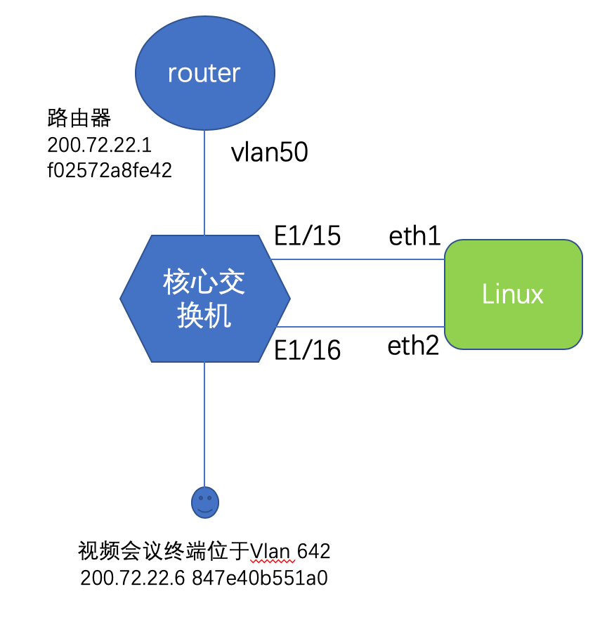

# MacAnyVlan

## Sample config


## 实际应用： 视频会议终端与路由器不在同一个vlan



1.1 Linux上配置文件：

* router.conf内容
```
router_dev eth1
f02572a8fe42 50
```

* mvc.conf内容

```
client_dev eth2
847e40b551a0 50
```

1.2 启动时执行命令：
```
ip link set eth1 up
ip link set eth2 up
ethtool -K eth1 gro off
ethtool -K eth2 gro off
ifconfig eth1 mtu 1508
ifconfig eth2 mtu 1508
./MacAnyVlan -c mvc.conf -r router.conf
```


1.3 核心交换机配置：
```
interface Ethernet1/15
  description macanyvlan-eth1-router
  switchport
  switchport mode trunk
  switchport trunk allowed vlan 50
  spanning-tree port type edge
  spanning-tree bpdufilter enable
interface Ethernet1/16
  description macanyvlan-eth2-client
  switchport
  switchport mode trunk
  switchport trunk allowed vlan 642
  spanning-tree port type edge trunk
  spanning-tree bpdufilter enable
```

1.4 核心交换机地址转发表：
```
USTC-N7K-1# show mac add address 847e.40b5.51a0
 Note: MAC table entries displayed are getting read from software.
 Use the 'hardware-age' keyword to get information related to 'Age' 

 Legend: 
        * - primary entry, G - Gateway MAC, (R) - Routed MAC, O - Overlay MAC
        age - seconds since last seen,+ - primary entry using vPC Peer-Link,
        (T) - True, (F) - False ,  ~~~ - use 'hardware-age' keyword to retrieve age info 
   VLAN     MAC Address      Type      age     Secure NTFY Ports/SWID.SSID.LID
---------+-----------------+--------+---------+------+----+------------------
* 50       847e.40b5.51a0    dynamic     ~~~      F    F  Eth1/15
* 642      847e.40b5.51a0    dynamic     ~~~      F    F  Eth8/5

USTC-N7K-1# show mac add address f025.72a8.fe42
 Note: MAC table entries displayed are getting read from software.
 Use the 'hardware-age' keyword to get information related to 'Age' 

 Legend: 
        * - primary entry, G - Gateway MAC, (R) - Routed MAC, O - Overlay MAC
        age - seconds since last seen,+ - primary entry using vPC Peer-Link,
        (T) - True, (F) - False ,  ~~~ - use 'hardware-age' keyword to retrieve age info 
   VLAN     MAC Address      Type      age     Secure NTFY Ports/SWID.SSID.LID
---------+-----------------+--------+---------+------+----+------------------
* 50       f025.72a8.fe42    dynamic     ~~~      F    F  Eth1/5
* 642      f025.72a8.fe42    dynamic     ~~~      F    F  Eth1/16
```
